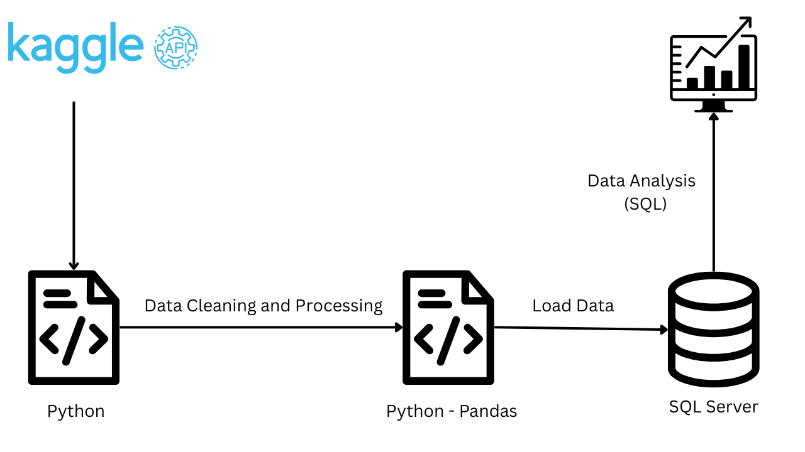

# Retail Orders Data Analytics Project

## Overview
📊 This project focuses on analyzing retail order data to extract meaningful insights using **Python**, **SQL**, and **Excel**. The dataset is sourced from Kaggle and processed using various tools for data cleaning, storage, and querying.

## Dataset
- **Source**: [Retail Orders Dataset on Kaggle](https://www.kaggle.com/datasets/ankitbansal06/retail-orders?select=orders.csv) 📥
- **File Used**: `orders.csv` 📂
- **Description**: The dataset contains retail transaction data, including product sales, categories, regions, and order dates.

## Project Workflow
1. **Data Extraction**: Download the dataset from Kaggle using the Kaggle API. 🛠️
2. **Data Cleaning and Processing**: 
   - Clean and preprocess the data using **Python** 🐍 and **Pandas**.
   - Handle missing values, correct data types, and filter relevant records.
3. **Data Storage**: 
   - Load the cleaned data into a **SQL Server** database. 💾
4. **Data Analysis**: 
   - Perform various analytical tasks using **SQL** queries 📅.
5. **Visualization & Insights**: 
   - Generate visualizations and summary tables using **Excel** 📊 and **SQL Server Management Studio** (SSMS). 

## Tools Used
- **Excel**: For data visualization and summary statistics. 📈
- **Jupyter Notebook**: For data preprocessing using **Python** 🐍 and **Pandas**. 📓
- **SQL Server Management Studio (SSMS)**: For executing SQL queries and analyzing the data. 🖥️
- **SQL Server**: Database for storing and managing the dataset. 🗃️
- **Kaggle API**: To automate the dataset download process. 📥

## SQL Queries Used
The project utilizes various SQL queries to extract insights such as:
- Total orders count. 🧮
- Revenue generation and sales trends. 💰
- Performance of products across different regions. 🌍
- Month-over-month sales comparisons for different years. 📅
- Category and subcategory performance analysis. 📊

## Conclusion
This project demonstrates how to process and analyze retail order data using a combination of **Python**, **SQL**, and **Excel**. The insights gained from this analysis help businesses understand sales trends, product performance, and regional demand. Future improvements could include integrating **Power BI** for interactive dashboards and automating data updates for real-time analysis.

## Author
👨‍💻 Bilal BOUDJEMA
